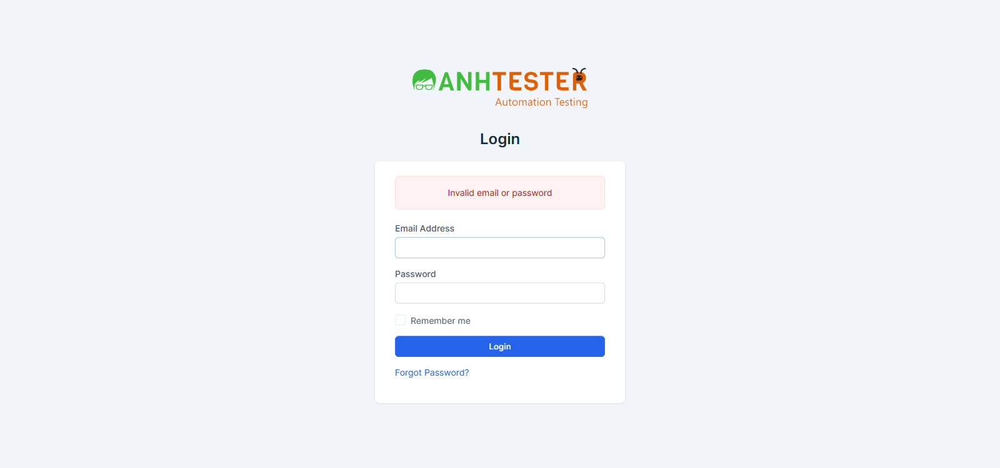

# Retest Report — LOGIN · Web · Build trạng thái 01-10-2026

| Thông tin | Nội dung |
|---|---|
| Retest ID | retest_1790849000 |
| Mode | RETEST (chỉ verify bug) — user chọn; bug Minor, fix cô lập |
| Bug retest | [BUG_login_1787226514_TC016](../../../../bugs/login/web/BUG_login_1787226514_TC016.md) |
| Build lúc log bug → Build retest | "trạng thái 20-08-2026" → "trạng thái 01-10-2026" — demo không có trang version nên **không đối chiếu được số build**; user xác nhận dev đã deploy bản fix trước khi chạy |
| Môi trường | `https://crm.anhtester.com/admin/authentication` — môi trường dùng chung |
| Tài khoản | Không đăng nhập (chỉ gửi 1 email không tồn tại, không chạm tài khoản có thật) |
| Người thực hiện | Claude Code (agent) qua Playwright MCP — Chromium 155, mỗi lần chạy trong ngữ cảnh mới (tương đương ẩn danh, không tự điền) |
| Thời gian | 01-10-2026 |
| Môi trường dùng chung? | Có — không thao tác phá huỷ |

## 1. Kết quả verify bug

| | |
|---|---|
| Bug | BUG_login_1787226514_TC016 — Ô Email không giữ lại giá trị vừa nhập sau khi đăng nhập thất bại |
| Severity gốc | 🟡 Minor |
| TC / REQ liên quan | CRM_LOGIN_TC_016 · REQ-LOGIN-16 |
| **Kết quả** | ❌ **NOT_FIXED** |
| Expected (theo bug gốc) | Sau khi trang nạp lại, ô Email còn hiển thị `notexist_tc016_20260820@auto.test` |
| Actual lần này | Dải `Invalid email or password` hiện đúng, nhưng ô Email **rỗng**; thẻ `input#email` do máy chủ trả về không có thuộc tính `value` — giống hệt Actual gốc |
| Số lần lặp | 2/2 đều lỗi (chạy đúng Steps gốc, dữ liệu gốc) |
| Evidence |   |

## 2. Regression quanh vùng fix

Không chạy — Mode RETEST.

## 3. Dữ liệu đã tạo & dọn dẹp

| Dữ liệu | ID | Nơi tạo | Đã xoá? |
|---|---|---|---|
| Không tạo dữ liệu (email `notexist_…` chỉ gửi lên form, không có tài khoản) | — | — | — |

## 4. Kết luận & đề xuất

| Bug | Trạng thái đề xuất | Lý do |
|---|---|---|
| BUG_login_1787226514_TC016 | 🔴 **Giữ mở** | Lỗi vẫn tái hiện 2/2 lần; không tạo bug trùng |

- Nếu dev đã deploy bản fix thì bản đó **chưa tới** môi trường `crm.anhtester.com`, hoặc fix chưa đúng chỗ (nhánh xử lý đăng nhập thất bại vẫn không truyền `email` vào `value` của `#email`). Đề nghị dev xác nhận lại bản đã deploy.
