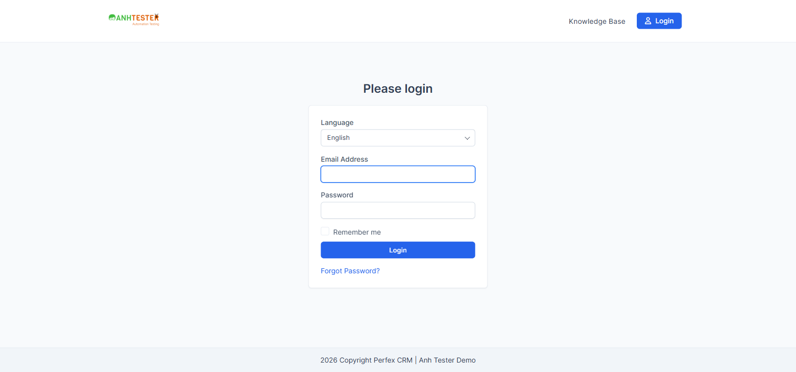

# Execution Report — LOGIN · Web · Thực thi tay qua Playwright MCP

| Thông tin | Nội dung |
|---|---|
| Run ID | run_1790182902 |
| Nền tảng | `web` |
| Nguồn TC | [docs/testcases/login/web/test_cases_login_web.md](../../../../testcases/login/web/test_cases_login_web.md) |
| Phạm vi | 10 TC — `CRM_LOGIN_TC_001` → `CRM_LOGIN_TC_010` (Nhóm A + Nhóm B) |
| Môi trường | `https://crm.anhtester.com/admin/authentication` — môi trường dùng chung |
| Build / Version | — (không có thông tin build) |
| Tài khoản | `admin@example.com` (Admin) và `projectmanager@example.com` (Project Manager) — từ `.env` (`LOGIN_EMAIL`/`LOGIN_PASSWORD`, `PM_EMAIL`/`PM_PASSWORD`; PM do user bổ sung giữa buổi chạy để gỡ BLOCKED cho `TC_006`) |
| Người thực hiện | Claude Code (agent) qua Playwright MCP |
| Bắt đầu → Kết thúc | 24-09-2026 (2 phiên: 10 TC đầu + retest `TC_006` sau khi có tài khoản PM, tổng ~18 phút) |
| Môi trường dùng chung? | Có — auto-skip thao tác phá huỷ đang BẬT (nhóm TC này không có thao tác phá huỷ nào nên không TC nào bị skip) |

## 1. Tổng kết

| Trạng thái | Số lượng | Tỷ lệ |
|---|---|---|
| ✅ PASS | 9 | 90% |
| ❌ FAIL | 1 | 10% |
| ⚠️ BLOCKED | 0 | 0% |
| ⏭️ SKIPPED | 0 | 0% |
| **Tổng** | **10** | 100% |

> **Pass rate:** 9/10 = 90%
>
> `TC_006` ban đầu BLOCKED do thiếu tài khoản Project Manager trong `.env`; user bổ sung `PM_EMAIL`/`PM_PASSWORD` ngay trong buổi, TC được chạy lại và **PASS** — số liệu trên đã cập nhật theo kết quả cuối.

## 2. Kết quả từng TC

| TC ID | Test Scenario | Kết quả | Bước fail | Ghi chú |
|---|---|---|---|---|
| CRM_LOGIN_TC_001 | Mở trang đăng nhập khi chưa có phiên thì thấy biểu mẫu đăng nhập | ✅ PASS | — | URL, tab title, heading `Login` đúng. 🔧 `body.className` chứa `login_admin`, request `GET /admin/authentication` trả `200` |
| CRM_LOGIN_TC_002 | Biểu mẫu đăng nhập đủ thành phần và đúng trạng thái mặc định | ✅ PASS | — | 6/6 mục Bảng kiểm đạt: đủ 5 thành phần đúng thứ tự · autofocus ô Email · checkbox không disabled/unchecked · nút Login không disabled · `input#password` type=`password` giữ đủ 8 ký tự · click vào nhãn "Remember me" tích được checkbox. 🔧 `form.action`=`https://crm.anhtester.com/admin/authentication`, `method=post`, `email` có `autofocus=1`, 3 `label[for]` khớp `id` |
| CRM_LOGIN_TC_003 | Trang đăng nhập không có CAPTCHA, không đăng nhập bên thứ ba, không nạp JavaScript | ✅ PASS | — | 3/3 mục đạt: 0 phần tử CAPTCHA · đúng 1 `<form>` + 1 `button[type=submit]`, không có chữ "google"/"facebook"/"microsoft" trong HTML · 0 `<script>` và 0 request `.js` nào |
| CRM_LOGIN_TC_004 | Bấm logo trên trang đăng nhập thì về trang chủ công khai | ❌ FAIL | Bước 2–3 | Xem chi tiết #1 — **bug đã biết**, đã có [BUG_login_1787226513_TC004](../../../../bugs/login/web/BUG_login_1787226513_TC004.md), tái hiện y hệt hôm nay |
| CRM_LOGIN_TC_005 | Đăng nhập bằng tài khoản Admin hợp lệ thì vào được Dashboard | ✅ PASS | — | Dừng đúng `https://crm.anhtester.com/admin/`, tab `Dashboard`, `body.className` chứa đủ `app admin dashboard user-id-2`, có ảnh đại diện ở header. ⚠️ Lượt thử đầu tiên (dùng CSS selector thay vì snapshot-ref) gặp bất thường — xem ghi chú cuối mục 2 |
| CRM_LOGIN_TC_006 | Đăng nhập bằng tài khoản Project Manager thì vào Dashboard với bộ menu rút gọn | ✅ PASS | — | Chạy lại sau khi user cung cấp `PM_EMAIL`/`PM_PASSWORD`. Dừng đúng `https://crm.anhtester.com/admin/`, không dải lỗi. Menu trái đếm đúng **9** mục (`Dashboard, Customers, Projects, Tasks, Contracts, Sales, Support, Leads, Utilities` — loại 1 phần tử `<li>` đầu là khối đệm rỗng, không phải mục menu). Cả 5 mục cấm (`Subscriptions, Expenses, Estimate Request, Knowledge Base, Reports`) đều **không** xuất hiện trong toàn bộ text của menu, kể cả trong submenu ẩn. 🔧 `body.className` chứa `user-id-3` |
| CRM_LOGIN_TC_007 | Email được chuẩn hoá — khác kiểu chữ và thừa khoảng trắng vẫn đăng nhập được | ✅ PASS | — | 4/4 biến thể `a`,`b`,`c`,`d` đều vào Dashboard thành công, không dải lỗi. Ghi chú: biến thể `c`,`d` — đọc `#email.value` ngay sau khi gõ đã thấy khoảng trắng bị cắt (input `type=email` tự trim phía trình duyệt), nên phần chứng minh "hệ thống bỏ qua khoảng trắng" ở đây nghiêng về **hành vi trình duyệt** hơn là **server**; kết quả quan sát được (đăng nhập thành công) vẫn khớp đúng Expected của TC |
| CRM_LOGIN_TC_008 | Tích Ghi nhớ đăng nhập thì hệ thống phát hành cookie ghi nhớ | ✅ PASS | — | Checkbox tích ✔ trước khi gửi, đăng nhập thành công vào `/admin/`. 🔧 cookie `autologin` tồn tại đúng hình thái `a:2:{s:7:"user_id";s:1:"<id>";s:3:"key";s:16:"<16 ký tự hex>";}` — đã kiểm được (🔒 không ghi giá trị thật) |
| CRM_LOGIN_TC_009 | Không tích Ghi nhớ đăng nhập thì hoàn toàn không phát hành cookie ghi nhớ | ✅ PASS | — | Trước bước 1: xoá cookie xong `document.cookie` rỗng. Checkbox rỗng, không tích, đăng nhập thành công. 🔧 sau bước 5 `document.cookie` vẫn **rỗng** — không có `autologin` |
| CRM_LOGIN_TC_010 | Bấm nút Login hai lần liên tiếp vẫn vào đúng Dashboard, không sinh trang lỗi | ✅ PASS | — | Bấm 2 lần liên tiếp (script đồng bộ, không có khoảng chờ giữa 2 lần bấm) → dừng đúng `/admin/` Dashboard, không dải lỗi, không xuất hiện `419 Page Expired!` |

> ⚠️ **Ghi chú vận hành (không phải kết quả TC):** Lượt điền form đầu tiên cho `TC_005` (dùng `browser_fill_form` với CSS selector `#email`/`#password` rồi click `button[type=submit]`) cho kết quả bất thường: `POST /admin/authentication` trả `303` nhưng `Location` trỏ về `/` thay vì `/admin/` — kéo theo `307` sang `/authentication/login` (trang đăng nhập khách hàng), dù session admin **vẫn được tạo thành công** (xác nhận bằng cách mở lại `/admin/authentication` ngay sau đó → tự chuyển vào `/admin/` Dashboard). Lượt thử lại **sạch** (đăng xuất → snapshot → thao tác đúng theo ref, đúng thứ tự bắt buộc của dự án) cho kết quả đúng 100% như Expected. Vì phương pháp lượt đầu không theo đúng thứ tự `navigate → snapshot → interact` bắt buộc, kết quả chính thức của `TC_005` lấy theo lượt thử lại. Ghi lại ở đây để tham khảo — nếu hiện tượng `303 → /` này lặp lại ở lần chạy khác (không do lỗi thao tác), đó có thể là một race condition thật của hệ thống, nên thử lại/theo dõi thêm trước khi mở bug.

## 3. Chi tiết TC FAIL

### FAIL #1 — CRM_LOGIN_TC_004 · Bấm logo trên trang đăng nhập thì về trang chủ công khai

| | |
|---|---|
| REQ ID | REQ-LOGIN-04 |
| Priority | Low |
| Bước fail | Bước 2–3 |
| **Expected** | Trang chuyển sang trang chủ công khai; thanh địa chỉ dừng ở `https://crm.anhtester.com/` |
| **Actual** | Thanh địa chỉ dừng ở `https://crm.anhtester.com/authentication/login`, tiêu đề tab đổi thành `Please login` — là cổng đăng nhập khách hàng, không phải trang chủ công khai |
| Evidence |  |
| Tái hiện được? | Có — khớp 100% với bug đã mở [BUG_login_1787226513_TC004](../../../../bugs/login/web/BUG_login_1787226513_TC004.md) (phát hiện 20-08-2026, chưa có lần retest nào). **Không cần sinh bug report mới** — đây là bug cũ chưa fix, chỉ ghi nhận vẫn còn tái hiện ở lần chạy này |

## 4. TC BLOCKED

_(không còn TC nào BLOCKED — `TC_006` đã được gỡ chặn và chạy PASS sau khi user bổ sung tài khoản PM, xem mục 2)_

## 5. Dữ liệu đã tạo & dọn dẹp

Không có bản ghi nghiệp vụ nào được tạo trong lượt chạy này (module Đăng nhập không tạo dữ liệu nghiệp vụ). Chỉ có trạng thái phiên/cookie:

| Dữ liệu | Nơi tạo | Đã dọn? |
|---|---|---|
| Cookie `autologin` (phát hành ở `TC_008`) | Trình duyệt, domain `crm.anhtester.com` | ✅ Đã xoá thủ công qua `document.cookie` sau `TC_010`, xác nhận `document.cookie` rỗng |
| Phiên đăng nhập Admin / PM (mở lại nhiều lần qua các TC) | `crm.anhtester.com/admin/` | ✅ Đã đăng xuất (`/admin/authentication/logout`) sau `TC_006`, kết thúc buổi chạy ở trạng thái chưa đăng nhập |

> Môi trường trả về đúng nguyên trạng: chưa đăng nhập, không cookie `autologin`.

## 6. Đề xuất bước tiếp theo

1. **`TC_004` FAIL** — không cần sinh bug report mới, đây là bug đã mở từ 20-08-2026 ([BUG_login_1787226513_TC004](../../../../bugs/login/web/BUG_login_1787226513_TC004.md)), lần chạy này chỉ xác nhận **vẫn tái hiện**, chưa được fix. Đề nghị cập nhật "Lịch sử retest" của bug đó bằng `/retest-fixed-bugs` nếu có ý định retest chính thức, hoặc để nguyên vì đây không phải một lượt retest có chủ đích.
2. **`TC_006`** — đã PASS sau khi bổ sung `PM_EMAIL`/`PM_PASSWORD` vào `.env`. Không cần hành động thêm.
3. **Ghi chú kỹ thuật `TC_007`** (khoảng trắng bị trim ở phía trình duyệt, không chắc server có tự trim hay không) — không phải lỗi, nhưng nếu muốn tách bạch rõ "server-side vs browser-side trim" thì cần kiểm bằng cách gửi request trực tiếp (curl/API) bỏ qua input HTML — ngoài phạm vi của một lượt chạy tay qua UI.
4. Có thể tiếp tục chạy `TC_011` → `TC_057` ở lượt sau để hoàn tất toàn bộ 57 TC.
