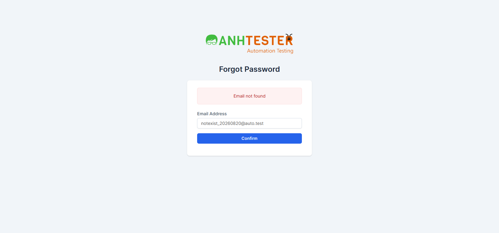

# Execution Report — LOGIN · Web · Thực thi tay qua Playwright MCP

| Thông tin | Nội dung |
|---|---|
| Run ID | run_1790185822 |
| Nền tảng | `web` |
| Nguồn TC | [docs/testcases/login/web/test_cases_login_web.md](../../../../testcases/login/web/test_cases_login_web.md) |
| Phạm vi | 7 TC — `CRM_LOGIN_TC_029` (retest bug cũ) + Nhóm L `CRM_LOGIN_TC_052`→`CRM_LOGIN_TC_057` (theo checkpoint review [testcase_review_report_web_20260924.md](../../../../testcases/login/review/testcase_review_report_web_20260924.md)) |
| Môi trường | `https://crm.anhtester.com/admin/authentication` — môi trường dùng chung |
| Build / Version | — (không có thông tin build) |
| Tài khoản | `admin@example.com` (Admin) — từ `.env` (`LOGIN_EMAIL`/`LOGIN_PASSWORD`) |
| Người thực hiện | Claude Code (agent) qua Playwright MCP |
| Bắt đầu → Kết thúc | 24-09-2026 (1 phiên, ~15 phút) |
| Môi trường dùng chung? | Có — auto-skip thao tác phá huỷ đang BẬT (nhóm TC này không có thao tác phá huỷ nào nên không TC nào bị skip) |

## 1. Tổng kết

| Trạng thái | Số lượng | Tỷ lệ |
|---|---|---|
| ✅ PASS | 6 | 85.7% |
| ❌ FAIL | 1 | 14.3% |
| ⚠️ BLOCKED | 0 | 0% |
| ⏭️ SKIPPED | 0 | 0% |
| **Tổng** | **7** | 100% |

> **Pass rate:** 6/7 = 85.7%
>
> `TC_029` FAIL đúng như dự đoán ở [báo cáo review 24-09-2026](../../../../testcases/login/review/testcase_review_report_web_20260924.md) — bug mở từ 20-08-2026 vẫn tái hiện sau 5 tuần chưa retest, giờ đã có bằng chứng mới nhất. **6 TC còn lại đều PASS**, trong đó `TC_053`, `TC_056`, `TC_057` là 3 TC mang `@NeedsVerify` — kỳ vọng suy từ REQ nay đã được đo đúng trên hệ thống thật, đề nghị gỡ tag này khỏi cả 3.

## 2. Kết quả từng TC

| TC ID | Test Scenario | Kết quả | Bước fail | Ghi chú |
|---|---|---|---|---|
| CRM_LOGIN_TC_029 | 🐞 Nhập email không tồn tại trong hệ thống thì báo không tìm thấy | ❌ FAIL | Bước 5 | Xem chi tiết #1 — **bug đã biết** [BUG_login_1787226517_TC029](../../../../bugs/login/web/BUG_login_1787226517_TC029.md) (mở 20-08-2026, chưa retest lần nào), tái hiện y hệt hôm nay sau 5 tuần |
| CRM_LOGIN_TC_052 | Ô tích Ghi nhớ đăng nhập bật và tắt được bằng cả ô vuông lẫn nhãn chữ | ✅ PASS | — | 2/2 biến thể đạt: `a` (bấm ô vuông) checked→unchecked→checked đúng thứ tự · `b` (bấm chữ "Remember me") checked→unchecked→checked đúng thứ tự |
| CRM_LOGIN_TC_053 | Ô tích Ghi nhớ trở về trạng thái nào sau khi gửi biểu mẫu thất bại | ✅ PASS | — | 2/2 biến thể đạt: `a` sai mật khẩu → dải `Invalid email or password`, checkbox trở về rỗng · `b` bỏ trống mật khẩu → dải `The Password field is required.`, checkbox trở về rỗng. **Đề nghị gỡ `@NeedsVerify` khỏi TC_053** — kỳ vọng đã xác nhận đúng trên UI thật (không dùng cửa sổ ẩn danh thủ công vì phiên Playwright MCP không có mật khẩu đã lưu/autofill nào can thiệp, tương đương điều kiện tiền đề) |
| CRM_LOGIN_TC_054 | Đăng xuất ở một tab thì tab còn lại cũng mất quyền truy cập ngay lần thao tác kế tiếp | ✅ PASS | — | Tab A đăng nhập → Dashboard; tab B mở `/admin/clients` thấy danh sách khách hàng; đăng xuất ở tab A → dừng đúng `/admin/authentication`; tab B **không nạp lại** vẫn còn nội dung cũ trên màn hình (đúng ý đồ bước 4); bấm `Dashboard` ở tab B → ngay lập tức bị đưa về `/admin/authentication`, không mở được Dashboard |
| CRM_LOGIN_TC_055 | Bấm Confirm hai lần liên tiếp ở trang Quên mật khẩu không sinh trang lỗi hết hạn | ✅ PASS | — | Bấm 2 lần liên tiếp (dispatch đồng bộ trong cùng 1 lệnh JS, không có khoảng chờ) → trang dừng xử lý bình thường, tab title không đổi thành `Error`, **không** xuất hiện `419 Page Expired!`, đúng 1 dải nguyên văn `Email not found`, vẫn ở `/admin/authentication/forgot_password` |
| CRM_LOGIN_TC_056 | Email có phần trước dấu @ dài tới đúng mốc 64 ký tự vẫn qua được bước kiểm định dạng ở trang Quên mật khẩu | ✅ PASS | — | 2/2 biến thể đạt, khớp đúng dự đoán "cùng cơ chế RFC 5321 như trang Đăng nhập": `a` (63 ký tự, tổng 75, đếm được đủ) → `Email not found` · `b` (đúng mốc 64, tổng 76, đếm được đủ) → `Email not found`. Cả hai đều **qua được** bước kiểm định dạng, chỉ dừng ở bước tra cứu tài khoản — đúng Expected. **Đề nghị gỡ `@NeedsVerify` khỏi TC_056** — kỳ vọng đã xác nhận đúng trên hệ thống thật |
| CRM_LOGIN_TC_057 | Email có phần trước dấu @ vượt mốc 64 ký tự bị chặn ở bước kiểm định dạng của trang Quên mật khẩu | ✅ PASS | — | 2/2 biến thể đạt: `a` (65 ký tự, vượt mốc 1 bậc) → `The Email Address field must contain a valid email address.` · `b` (100 ký tự) → cùng thông báo. Cả hai **khác hẳn** dải `Email not found` của TC_056 — xác nhận form này **có** bước kiểm định dạng riêng, không rơi vào kịch bản xấu "bỏ hẳn kiểm định dạng" mà TC lo ngại. **Đề nghị gỡ `@NeedsVerify` khỏi TC_057** |

## 3. Chi tiết TC FAIL

### FAIL #1 — CRM_LOGIN_TC_029 · Nhập email không tồn tại trong hệ thống thì báo không tìm thấy

| | |
|---|---|
| REQ ID | REQ-LOGIN-26 |
| Priority | High |
| Bước fail | Bước 5 |
| **Expected** | Sau khi dải báo lỗi `Email not found` hiển thị, ô Email trở về **rỗng** |
| **Actual** | Dải báo lỗi `Email not found` hiển thị đúng, nhưng ô Email **vẫn giữ nguyên** giá trị vừa nhập (`notexist_20260820@auto.test`) |
| Evidence |  |
| Tái hiện được? | Có — khớp 100% với bug đã mở [BUG_login_1787226517_TC029](../../../../bugs/login/web/BUG_login_1787226517_TC029.md) (phát hiện 20-08-2026). **Đây là lần retest đầu tiên kể từ khi bug được mở** — bug **vẫn còn tái hiện** sau 5 tuần, chưa được fix. Không cần sinh bug report mới, chỉ cập nhật Lịch sử retest của bug hiện có |

## 4. TC BLOCKED

| TC ID | Nguyên nhân chặn | Cần gì để chạy được |
|---|---|---|
_(không có TC nào BLOCKED)_

## 5. Dữ liệu đã tạo & dọn dẹp

Không tạo dữ liệu nghiệp vụ nào cần dọn — toàn bộ 7 TC chỉ thao tác trên biểu mẫu Đăng nhập / Quên mật khẩu với email không tồn tại hoặc thao tác đăng nhập/đăng xuất tài khoản Admin có sẵn, không tạo bản ghi mới nào trong hệ thống.

> Phiên đăng nhập Admin dùng trong `TC_054` đã được đăng xuất chủ động trong chính bước thực thi TC — không còn phiên nào bỏ ngỏ.

## 6. Đề xuất bước tiếp theo

- **`TC_029` vẫn FAIL** — cập nhật Lịch sử retest vào [BUG_login_1787226517_TC029](../../../../bugs/login/web/BUG_login_1787226517_TC029.md) (bug vẫn mở, không đóng). Đề nghị hỏi PO xem giữ lại email sau lỗi có phải hành vi cố ý hay không (như bug report gốc đã đặt câu hỏi) — nếu PO xác nhận là chủ đích thì sửa Expected của `TC_029` qua `/review-testcases`, nếu không thì giữ bug mở chờ fix.
- **Gỡ `@NeedsVerify` khỏi `TC_053`, `TC_056`, `TC_057`** trong `web/test_cases_login_web.md` và đồng bộ mục "Vùng chưa có evidence" của index — cả 3 TC đã được đo đúng như Expected hiện tại, không cần sửa nội dung, chỉ gỡ tag.
- Không có TC FAIL nào khác cần sinh bug report mới trong lượt chạy này.
