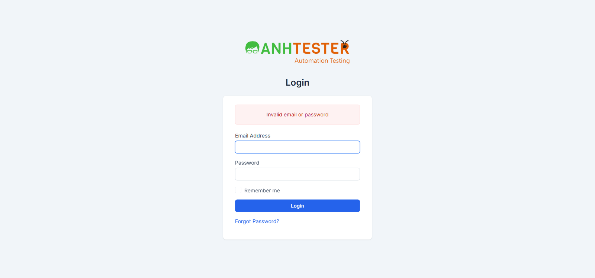
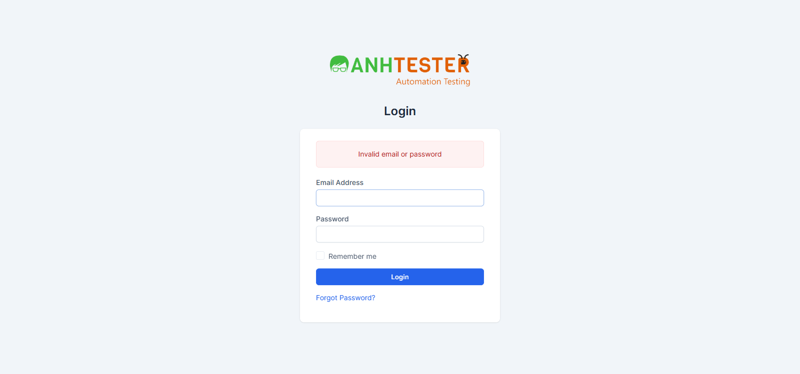

# Execution Report — LOGIN · Web · TC cập nhật & thêm mới từ 30-09-2026

| Thông tin | Nội dung |
|---|---|
| Run ID | run_1790782248 |
| Nền tảng | `web` |
| Nguồn TC | [parts/part_01](../../../../testcases/login/web/parts/part_01_web_dang_nhap.md) · [part_02](../../../../testcases/login/web/parts/part_02_web_phien_quen_mat_khau_dang_xuat.md) · [part_03](../../../../testcases/login/web/parts/part_03_web_phi_chuc_nang_bo_sung.md) · [part_04](../../../../testcases/login/web/parts/part_04_web_khoa_tai_khoan.md) (index: [test_cases_login_web.md](../../../../testcases/login/web/test_cases_login_web.md)) |
| Phạm vi | 27 TC — 11 TC sửa/mới của DELTA `CRM-LOGIN-101` (`011`, `013`, `015`, `016`, `017`, `025`, `043`, `047`, `050`, `053`, `058`) + 16 TC bổ sung `059` → `074`. Loại 1 TC `@Deprecated` (`CRM_LOGIN_TC_014`) |
| Môi trường | `https://crm.anhtester.com/admin/authentication` — môi trường dùng chung |
| Build / Version | — (không có thông tin build) |
| Tài khoản | `Project Manager` (`PM_EMAIL` trong `.env`) cho mọi lượt gửi sai · `Admin` chỉ dùng đăng nhập đúng và **đúng 1** lần sai ở `TC_069` (ngoại lệ đã ghi trong TC) |
| Người thực hiện | Claude Code (agent) qua Playwright MCP — Chromium 155 |
| Bắt đầu → Kết thúc | 30-09-2026 ~15:30 → ~15:55 |
| Môi trường dùng chung? | Có — auto-skip thao tác phá huỷ BẬT (không TC nào trong phạm vi bị chặn vì lý do này) |

> ⚠️ **Tính năng khoá tài khoản (`CRM-LOGIN-101`) CHƯA deploy** — đã kiểm chứng ngay trong buổi chạy: 5 lần sai liên tiếp bằng PM, lần 5 vẫn ra `Invalid email or password` và đăng nhập đúng ngay sau đó **vào được** `/admin/` (evidence bên dưới). Vì vậy 13 TC chỉ đúng sau deploy được chuyển `BLOCKED`, không chạy.

## 1. Tổng kết

| Trạng thái | Số lượng | Tỷ lệ |
|---|---|---|
| ✅ PASS | 11 | 40.7% |
| ❌ FAIL | 2 | 7.4% |
| ⚠️ BLOCKED | 14 | 51.9% |
| ⏭️ SKIPPED | 0 | 0% |
| **Tổng** | **27** | 100% |

> **Pass rate (không tính SKIPPED, có tính BLOCKED vào mẫu số):** 11/27 = 40.7%
> **Pass rate trên TC thực chạy có kết luận (PASS + FAIL):** 11/13 = 84.6%
> Trong 2 FAIL: `TC_016` là bug đã biết (`AMB-LOGIN-10`); `TC_015` FAIL vì **chưa deploy**, không phải bug.

## 2. Kết quả từng TC

| TC ID | Test Scenario | Kết quả | Bước fail | Ghi chú |
|---|---|---|---|---|
| CRM_LOGIN_TC_011 | Trường bắt buộc trên biểu mẫu đăng nhập | ✅ PASS | — | 4 biến thể `a`–`d` đều khớp nguyên văn (số dải và thứ tự) |
| CRM_LOGIN_TC_013 | Sai thông tin không tiết lộ email nào có thật | ✅ PASS | — | `a` (PM, sai mật khẩu) và `b` (email không tồn tại) đều đúng 1 dải `Invalid email or password`, cùng URL |
| CRM_LOGIN_TC_015 | Sai mật khẩu 5 lần thì khoá tài khoản | ❌ FAIL | 2 | **Chưa deploy** — xem chi tiết #2. `@NeedsVerify` → không mở bug |
| CRM_LOGIN_TC_016 | 🐞 Ô Email giữ lại email sau khi đăng nhập lỗi | ❌ FAIL | 5 | Bug đã biết `AMB-LOGIN-10` — xem chi tiết #1 |
| CRM_LOGIN_TC_017 | Chuỗi tấn công XSS / SQL ở ô Password | ✅ PASS | — | `a`, `b`: không hộp thoại, dải `Invalid email or password`, không dấu vết lỗi CSDL, chuỗi `<script>` không nằm trong HTML dạng thẻ sống. 🔧 mã HTTP `200` chưa đo trực tiếp |
| CRM_LOGIN_TC_025 | Mã CSRF không hợp lệ bị chặn | ✅ PASS | — | `a` (32 ký tự `0`), `b` (rỗng): tab `Error`, màn hình `419 Page Expired!` + dòng mô tả, không vào được `/admin/` |
| CRM_LOGIN_TC_043 | Nút Login luôn bấm được | ✅ PASS | — | Cả 3 biến thể: nền `rgb(37,99,235)`, chữ trắng, con trỏ `pointer`, không `disabled`, bấm được, trang nạp lại kèm dải lỗi |
| CRM_LOGIN_TC_047 | Mật khẩu rất dài | ✅ PASS | — | 256 và 1000 ký tự đều ra đúng 1 dải `Invalid email or password`, không lỗi máy chủ. 🔧 mã HTTP chưa đo trực tiếp |
| CRM_LOGIN_TC_050 | Tương thích trình duyệt | ⚠️ BLOCKED | — | Chỉ có Chromium — xem mục 4 |
| CRM_LOGIN_TC_053 | Ô tích Ghi nhớ sau khi gửi thất bại | ✅ PASS | — | Cả `a` và `b`: **có tích trước khi gửi → rỗng sau khi trang nạp lại** (khớp Expected). Đây là kết quả đo được — Expected đã có evidence, đề nghị gỡ `@NeedsVerify` |
| CRM_LOGIN_TC_058 | 4 lần sai chưa khoá, lần 5 đúng vẫn vào được | ✅ PASS | — | 4 dải `Invalid email or password`, lần 5 vào `/admin/` tiêu đề `(11) Dashboard` |
| CRM_LOGIN_TC_059 | Trong lúc khoá, mọi lần gửi báo `15 minutes` cố định | ⚠️ BLOCKED | — | Chưa deploy |
| CRM_LOGIN_TC_060 | Đang khoá thì mật khẩu đúng vẫn bị từ chối | ⚠️ BLOCKED | — | Chưa deploy |
| CRM_LOGIN_TC_061 | Tự mở khoá sau 15 phút | ⚠️ BLOCKED | — | Chưa deploy |
| CRM_LOGIN_TC_062 | Đăng nhập đúng trước khi đủ 5 lần sai thì bộ đếm về 0 | ✅ PASS | — | 2 đợt × 4 lần sai, xen đăng nhập đúng: không lần nào hiện thông báo khoá, cả hai lần đúng đều vào `/admin/`. Đăng xuất trung gian: xem ghi chú phương pháp |
| CRM_LOGIN_TC_063 | Bỏ trống mật khẩu 5 lần thì khoá | ⚠️ BLOCKED | — | Chưa deploy |
| CRM_LOGIN_TC_064 | Hết khoá thì bộ đếm về 0 | ⚠️ BLOCKED | — | Chưa deploy |
| CRM_LOGIN_TC_065 | Email không tồn tại: lần 5 báo `Email không tồn tại` | ⚠️ BLOCKED | — | Chưa deploy |
| CRM_LOGIN_TC_066 | Email không tồn tại: nhịp chờ 1 phút / 15 phút | ⚠️ BLOCKED | — | Chưa deploy |
| CRM_LOGIN_TC_067 | Email không tồn tại: gửi trong lúc chờ không cộng dồn | ⚠️ BLOCKED | — | Chưa deploy |
| CRM_LOGIN_TC_068 | PM bị khoá không chặn Admin cùng trình duyệt | ⚠️ BLOCKED | — | Chưa deploy |
| CRM_LOGIN_TC_069 | Lần sai rải trên nhiều email không cộng dồn (không khoá theo IP) | ✅ PASS | — | PM 4 sai + Admin 1 sai → cả 5 lần đều `Invalid email or password`; PM đăng nhập đúng vào `/admin/`; Admin đăng nhập đúng vào `/admin/` (tiêu đề `Dashboard`) |
| CRM_LOGIN_TC_070 | Đổi phiên trình duyệt không thoát được khoá | ⚠️ BLOCKED | — | Chưa deploy |
| CRM_LOGIN_TC_071 | CSRF sai 5 lần cũng khoá | ⚠️ BLOCKED | — | Chưa deploy |
| CRM_LOGIN_TC_072 | Bộ đếm tính riêng theo cách viết email | ✅ PASS | — | `a` (HOA toàn bộ), `b` (thừa khoảng trắng): 4 sai + 1 sai khác cách viết → đều `Invalid email or password`, đăng nhập đúng vào `/admin/`. ⚠️ Biến thể `b` xem ghi chú phương pháp — kết quả PASS **yếu** |
| CRM_LOGIN_TC_073 | Đã khoá thì đổi cách viết email cũng không vào được | ⚠️ BLOCKED | — | Chưa deploy |
| CRM_LOGIN_TC_074 | Khoá không đẩy phiên đang mở ra | ⚠️ BLOCKED | — | Chưa deploy |

### Ghi chú phương pháp (ảnh hưởng độ tin cậy)

1. **Đăng xuất trung gian dùng cách khác TC:** menu ảnh đại diện không mở được bằng thao tác tự động; điều hướng thẳng `/admin/authentication/logout` làm trình duyệt kẹt ở lần gửi kế tiếp. Nên mỗi lượt đăng nhập được chạy trong **một ngữ cảnh trình duyệt mới** (tương đương cửa sổ ẩn danh, không tự điền, không chung cookie) — kết quả về phía máy chủ tương đương đăng xuất, nhưng bước `Logout` bằng menu **chưa được kiểm** trong buổi này (`TC_062` bước 3, `TC_069` bước 5, `TC_050` bước 5).
2. **`TC_072` biến thể `b` (thừa khoảng trắng):** ô Email của form là `type=email` — trình duyệt tự cắt khoảng trắng đầu/cuối (giá trị đọc lại từ ô = `projectmanager@example.com`), nên biến thể này thực tế **không gửi** email thừa khoảng trắng lên máy chủ. Cần chạy lại bằng công cụ gửi thẳng request (khi tính năng deploy) để kiểm thật.
3. **`TC_016`** chạy trong ngữ cảnh mới (không cookie, không tự điền) — đúng điều kiện TC yêu cầu.

## 3. Chi tiết TC FAIL

### FAIL #1 — CRM_LOGIN_TC_016 · 🐞 Ô Email phải còn giữ email vừa nhập

| | |
|---|---|
| REQ ID | REQ-LOGIN-16 |
| Priority | High |
| Bước fail | Bước 5 |
| **Expected** | Ô Email còn hiển thị giá trị `PM_EMAIL` sau khi đăng nhập thất bại |
| **Actual** | Dải `Invalid email or password` hiện đúng (bước 4 đạt), nhưng ô Email **rỗng**; 🔧 thẻ `input#email` do máy chủ trả về **không có thuộc tính `value`** |
| Evidence |  |
| Tái hiện được? | Có — chạy 2 lần (lần đầu chưa lưu được ảnh do lỗi đường dẫn, lần hai lưu ảnh), cùng kết quả |
| Phân loại | **Bug đã biết** — PO xác nhận `AMB-LOGIN-10`. FAIL là kết quả đúng, không sửa TC |

### FAIL #2 — CRM_LOGIN_TC_015 · Sai mật khẩu 5 lần liên tiếp thì tài khoản bị khoá

| | |
|---|---|
| REQ ID | REQ-LOGIN-41 |
| Priority | High |
| Bước fail | Bước 2 (lần 5) — chạy đủ 5 lần gửi sai, rồi đăng nhập đúng để dọn trạng thái |
| **Expected** | Lần 5 trang chứa `Your account is locked. Please try again in 15 minutes.` |
| **Actual** | Lần 5 vẫn ra đúng 1 dải `Invalid email or password`; đăng nhập đúng ngay sau đó **vào được** `/admin/` (không bị chặn) |
| Evidence |  |
| Tái hiện được? | Đo cùng kết quả với `TC_058`/`TC_072`/`TC_069` trong buổi này (5 lần sai liên tiếp trên PM đều không khoá) |
| Phân loại | ⚠️ **Không phải bug** — TC `@NeedsVerify`, tính năng chưa deploy (`AMB-LOGIN-27` ✅ 30-09-2026). **Không** trỏ `/create-bug-report`. Chạy lại khi PO xác nhận đã deploy |

## 4. TC BLOCKED

| TC ID | Nguyên nhân chặn | Cần gì để chạy được |
|---|---|---|
| CRM_LOGIN_TC_050 | Playwright MCP chỉ có Chromium — biến thể `b` (Edge), `c` (Firefox) không chạy được. Biến thể `a` (Chrome/Chromium) đã chạy: đủ 7 thành phần, đăng nhập đúng vào `/admin/`, sai mật khẩu ra đúng 1 dải nguyên văn → **đạt**, nhưng TC chưa đủ biến thể nên không chấm PASS | Máy có Edge + Firefox, hoặc chạy bằng framework automation (Firefox đóng gói kèm Playwright) |
| CRM_LOGIN_TC_059, 060, 061, 063, 064, 065, 066, 067, 068, 070, 071, 073, 074 (13 TC) | Tính năng khoá tài khoản `CRM-LOGIN-101` chưa deploy — Expected chỉ đúng sau deploy. Đã đo trong buổi chạy ở `TC_015` | PO xác nhận deploy. Chạy **cuối đợt, tuần tự**, báo đội trước (11 TC khoá PM 15 phút — `AMB-LOGIN-28`); `061`, `064`, `066`, `067` mỗi TC ~17–31 phút |

## 5. Dữ liệu đã tạo & dọn dẹp

| Dữ liệu | ID | Nơi tạo | Đã xoá? |
|---|---|---|---|
| Không tạo bản ghi nghiệp vụ nào | — | — | — |

> Ảnh hưởng duy nhất lên hệ thống: các lượt đăng nhập thử của `Project Manager` (và 1 lượt sai của `Admin` ở `TC_069`). Mọi chuỗi lần sai đều kết thúc bằng **một lần đăng nhập đúng** nên bộ đếm lần sai của PM/Admin về 0. Không có tài khoản nào bị khoá. Trình duyệt Playwright còn 1 tab đang mở ở trạng thái đã đăng nhập PM (phiên của agent).

## 6. Đề xuất bước tiếp theo

- `TC_016` → bug đã biết `AMB-LOGIN-10`; kiểm `docs/bugs/README.md` xem đã có bug chưa, chưa có thì `/create-bug-report`.
- `TC_015` + 13 TC BLOCKED → chờ PO xác nhận deploy, rồi chạy lại nhóm M (part 4) bằng `/execute-test-cases` với môi trường sẵn sàng khoá PM 15 phút.
- `TC_053` khớp Expected → `/review-testcases` mode FIX để gỡ `@NeedsVerify`.
- `TC_072` biến thể `b` và `TC_017`/`TC_047` phần 🔧 (mã HTTP) → cần công cụ gửi request thẳng hoặc DevTools mở tay.
- `TC_050` → cần Edge + Firefox.
- Phát hiện công cụ: Playwright MCP kẹt lần gửi form kế tiếp trên tab đã vào Dashboard — nên chạy mỗi lượt đăng nhập trong ngữ cảnh mới (đã dùng trong buổi này).
