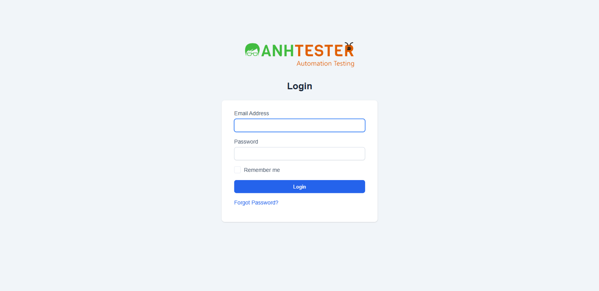

# Execution Report — LOGIN · STORY-LOGIN-04 (Bảo vệ phiên & điều hướng)

| Thông tin | Nội dung |
|---|---|
| Run ID | run_1790792334 |
| Nền tảng | `web` |
| Nguồn TC | [part_02_web_phien_quen_mat_khau_dang_xuat.md](../../../../testcases/login/web/parts/part_02_web_phien_quen_mat_khau_dang_xuat.md) (Nhóm D) · [part_03_web_phi_chuc_nang_bo_sung.md](../../../../testcases/login/web/parts/part_03_web_phi_chuc_nang_bo_sung.md) (`TC_039`) |
| Phạm vi | 8 TC của STORY-LOGIN-04 — REQ `17` → `22`, `42`, `44` · loại 0 TC `@Deprecated` |
| Môi trường | `https://crm.anhtester.com` — môi trường demo |
| Build / Version | Không được cung cấp |
| Tài khoản | `Admin` · `Project Manager` — lấy từ `.env`, **không** ghi giá trị vào report |
| Người thực hiện | QA (agent hỗ trợ) — agent **không** tự nhập mật khẩu; mọi bước đăng nhập do QA gõ trên cửa sổ Chrome của Playwright, agent dựng trạng thái và chấm kết quả |
| Trình duyệt | Google Chrome (Playwright MCP, headed). Viewport hạ từ `1600×750` xuống `1537×750` — số đo cho thấy viewport rộng hơn cửa sổ (`inner 1600` > `outer 1554`), trang bị cắt ~46px bên phải. MCP khởi động lại trình duyệt một lần giữa buổi (01:29) → hạ lại lần hai |
| Bắt đầu → Kết thúc | 01-10-2026 01:18 → 01:38 (20 phút, gồm thời gian chờ QA đăng nhập) |
| Môi trường dùng chung? | Có — auto-skip TC phá huỷ đang BẬT |

## 1. Tổng kết

| Trạng thái | Số lượng | Tỷ lệ |
|---|---|---|
| ✅ PASS | 5 | 62.5% |
| ❌ FAIL | 1 | 12.5% |
| ⚠️ BLOCKED | 0 | 0% |
| ⏭️ SKIPPED | 2 | 25.0% |
| **Tổng** | **8** | 100% |

> **Pass rate (không tính SKIPPED):** 5/6 = 83.3%. FAIL duy nhất (`TC_039`) là bug **đã biết, đang mở** — không phát sinh lỗi mới.

## 2. Kết quả từng TC

| TC ID | Test Scenario | Kết quả | Bước fail | Ghi chú |
|---|---|---|---|---|
| CRM_LOGIN_TC_021 | Mở thẳng URL nội bộ khi chưa đăng nhập thì bị đưa về trang đăng nhập | ✅ PASS | — | `a` `/admin/clients` · `b` `/admin/` → cả hai dừng ở `/admin/authentication`, tab `Perfex CRM \| Anh Tester Demo - Login`, chỉ hiện biểu mẫu đăng nhập. Trạng thái sạch dựng bằng Đăng xuất (trình duyệt còn phiên PM từ trước) |
| CRM_LOGIN_TC_022 | Bị chuyển về trang đăng nhập thì không giữ lại URL đích ban đầu | ✅ PASS | — | 3. URL trần `https://crm.anhtester.com/admin/authentication`, không tham số · 5. Sau khi QA đăng nhập Admin: dừng ở `/admin/`, tab `Dashboard`, **không** quay lại `/admin/clients`. Lần đăng nhập đầu bị mất do MCP khởi động lại trình duyệt, lần thứ hai là PM (sai vai trò, xuất phát từ `/admin/`) → **không tính**; chạy lại từ bước 1 |
| CRM_LOGIN_TC_023 | Đang có phiên thì mở trang đăng nhập hoặc Quên mật khẩu đều bị đưa về Dashboard | ✅ PASS | — | `a`, `b` Admin · `c`, `d` PM — cả 4 dừng ở `/admin/`, tab có chữ `Dashboard`, không hiện biểu mẫu đăng nhập/Quên mật khẩu. 🔧 `user-id-2` ở `a`,`b` · `user-id-3` ở `c`,`d` — khớp |
| CRM_LOGIN_TC_024 | Biểu mẫu đăng nhập mang mã chống CSRF đúng hình thái và gửi kèm khi submit | ✅ PASS | — | 4. Đăng nhập Admin có tích `Remember me` → dừng ở `/admin/`. 🔧`1` đúng 1 mã, dài 32, toàn hex · 🔧`2` nạp lại thật (`navigation.type = reload`) mã **giữ nguyên** · 🔧`3` biểu mẫu `POST` gửi đủ 4 tham số `csrf_token_name`, `email`, `password`, `remember` (đọc qua danh sách field của biểu mẫu, **không** đọc thân request để tránh ghi mật khẩu vào log), giá trị `remember` = `estimate`; hệ quả cookie `autologin` được cấp đúng hình thái, `user_id` = 2. Lần đăng nhập đầu QA chưa tích `Remember me` → không tính, chạy lại. Phím F5 giả lập qua Playwright **không** nạp lại trang → dùng `location.reload()` |
| CRM_LOGIN_TC_025 | Gửi biểu mẫu với mã CSRF không hợp lệ thì bị chặn, không xử lý đăng nhập | ✅ PASS | — | Tài khoản PM. `a` mã toàn số 0 · `b` mã rỗng → cả hai: 3. trang lỗi · 4. tab `Error` · 5. đúng nguyên văn `419 Page Expired!` + `Sorry, the page has expired, return to previous page and refresh to continue.` · 6. mở `/admin/` bị đưa về trang đăng nhập. Mã thực gửi đi được xác nhận bằng bộ theo dõi request **chỉ ghi tham số `csrf_token_name`** (`a`: 32 ký tự toàn số 0 · `b`: rỗng). 🔧 header trả `403` (lệch nội dung `419` — đúng hiện trạng `AMB-LOGIN-08`, không chấm theo mã HTTP). ⚠️ **Lần thử đầu của `a` không tính** — xem mục 4 |
| CRM_LOGIN_TC_026 | Phiên đăng nhập hết hạn sau 1 giờ không thao tác | ⏭️ SKIPPED | — | `@PersonalOnly` — QA tự chạy (~65 phút) |
| CRM_LOGIN_TC_039 | 🐞 Truy cập trang đăng nhập qua HTTP thuần phải bị ép chuyển hướng sang HTTPS | ❌ FAIL | 3 | Thanh địa chỉ giữ nguyên `http://`. Chrome **không** tự nâng cấp giao thức ở lần chạy này nên phép thử hợp lệ. FAIL **đúng kỳ vọng** — bug [BUG_login_1785678750_TC039](../../../../bugs/login/web/BUG_login_1785678750_TC039.md) đang mở. Xem FAIL #1 |
| CRM_LOGIN_TC_051 | Đang thao tác thì phiên được gia hạn | ⏭️ SKIPPED | — | `@PersonalOnly` — QA tự chạy (~70 phút) |

## 3. Chi tiết TC FAIL

### FAIL #1 — CRM_LOGIN_TC_039 · Truy cập trang đăng nhập qua HTTP thuần phải bị ép chuyển hướng sang HTTPS

| | |
|---|---|
| REQ ID | REQ-LOGIN-44 |
| Priority | High |
| Bước fail | Bước 3 — URL sau khi tải xong |
| **Expected** | Thanh địa chỉ đã chuyển thành `https://crm.anhtester.com/admin/authentication`, có biểu tượng kết nối an toàn |
| **Actual** | Trang đăng nhập hiển thị và dùng được ngay trên `http://crm.anhtester.com/admin/authentication`, không chuyển hướng |
| 🔧 Ghi chú kỹ thuật | Trên trang: `location.protocol = http:` · `isSecureContext = false` · `navigation.responseStatus = 200` · `redirectCount = 0` · 12 lỗi console CORS font (khác origin `http`↔`https`). `curl -I`: bản HTTP trả `200`, không `Location`; bản HTTPS trả `200`, không `Strict-Transport-Security` |
| Evidence |  — ảnh Playwright chỉ chụp vùng trang, **không** có thanh địa chỉ; bằng chứng giao thức nằm ở dòng 🔧 |
| Tái hiện được? | Có — trùng khớp bug đang mở [BUG_login_1785678750_TC039](../../../../bugs/login/web/BUG_login_1785678750_TC039.md) (NOT_FIXED từ 20-08-2026). **Không** mở bug mới |

## 4. TC BLOCKED

Không có TC BLOCKED.

**Lần thử không tính — cần theo dõi:**

| TC | Hiện tượng | Vì sao không tính | Theo dõi |
|---|---|---|---|
| `TC_025-a` lần 1 | Agent sửa mã CSRF thành toàn số 0 (đã xác nhận trên trang), QA gõ tài khoản PM và bấm `Login` → **vào thẳng Dashboard** bằng PM, không ra trang `419` | Chưa gắn bộ theo dõi request nên **không chứng minh được** mã toàn số 0 còn nguyên lúc gửi (trang có thể đã nạp lại, mã trở về giá trị thật). Hai lần chạy sau có bộ theo dõi đều cho `419` đúng kỳ vọng | Ảnh: [CRM_LOGIN_TC_025_a_step3_vao_dashboard_lan1.png](evidence/CRM_LOGIN_TC_025_a_step3_vao_dashboard_lan1.png). Nếu lặp lại ở lần chạy sau **kèm** bằng chứng request → lỗ hổng CSRF, báo bug 🔴 ngay |
| `TC_022` lần 1, 2 · `TC_024` lần 1 | Mất phiên do MCP khởi động lại · đăng nhập sai vai trò · chưa tích `Remember me` | Lỗi thao tác khi dựng Test Data, không phải hành vi hệ thống | Đã chạy lại từ bước 1, kết quả chấm theo lần đúng |

## 5. Dữ liệu đã tạo & dọn dẹp

| Dữ liệu | ID | Nơi tạo | Đã xoá? |
|---|---|---|---|
| Không tạo bản ghi nghiệp vụ nào | — | — | — |
| Cookie `autologin` của Admin (từ `TC_024`) | — | Trình duyệt Playwright | ✅ Đăng xuất + xoá cookie khỏi trình duyệt |
| Lần đăng nhập sai của PM (`TC_025`: 2 lần có bằng chứng `419` + 1 lần không xác định nhưng đăng nhập thành công) | — | Máy chủ | ➖ Không cần dọn — tính năng khoá tài khoản chưa deploy (`AMB-LOGIN-27`), và dù deploy thì 2 lần sai liên tiếp vẫn dưới ngưỡng 5 |

> Trạng thái cuối: trình duyệt Playwright **chưa đăng nhập**, không còn cookie `autologin`. Bộ theo dõi request của `TC_025` còn gắn trên tab hiện tại (chỉ ghi `csrf_token_name` của `POST /admin/authentication`, không ghi ra đĩa) — mất khi đóng trình duyệt.

## 6. Đề xuất bước tiếp theo

- **FAIL #1 (`TC_039`)** → **không** chạy `/create-bug-report` (bug đang mở). QA chọn có ghi thêm dòng `❌ NOT_FIXED · 01-10-2026 · run_1790792334` vào *Lịch sử retest* của bug hay không
- **`TC_026`, `TC_051`** (`@PersonalOnly`) → QA tự chạy và theo dõi (~65 + ~70 phút) để phủ đủ `REQ-LOGIN-42`
- **`TC_025-a` lần 1** → theo dõi ở lần chạy sau; gắn bộ theo dõi request **ngay từ lần đầu** cho TC này
- **Cải thiện TC (qua `/review-testcases`, không sửa lúc chạy):** `TC_024` bước 2 ghi "Nhấn F5" — chạy qua Playwright thì phím F5 giả lập không nạp lại trang; `TC_039` nên ghi rõ ảnh chụp bằng công cụ không có thanh địa chỉ
- **Môi trường chạy:** cấu hình `--viewport-size 1600,750` rộng hơn cửa sổ thực tế (`1554`) → cân nhắc hạ xuống `1537,750` trong cấu hình MCP
